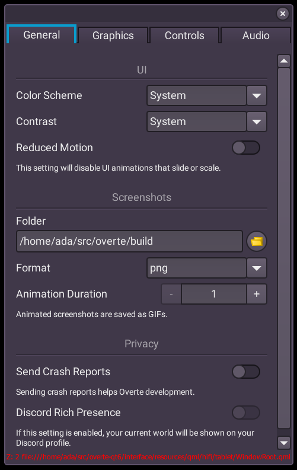
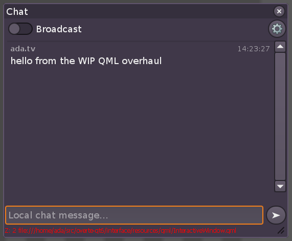

.. post:: 2025-11-05
   :author: Julian Groß

October progress report
-----------------------

Progress
^^^^^^^^

74hc595 again spent most of their time working on upgrading to Qt6. While chasing down crashes on Qt6, they uncovered and fixed multiple old memory safety issues, which have probably been causing issues for years now.
Of course, they also did their usual general contributions like reviewing and testing Pull Requests.

Ada spent a lot of time working on their new UI overhaul, which is part of the upgrade to Qt6.
Here are some work-in-progress screenshots:

|2025-11-05_settings_UI| |2025-11-05_chat| |2025-11-05_places_app|

.. |2025-11-05_places_app| image:: _images/2025-11-05_progress_report/places_app.png
    :alt: Screenshot of the work-in-progress QML Places app.
    :class: inline

HifiExperiments has been working on a fix for the `FBX texture coordinate regression 🔗 <https://github.com/overte-org/overte/issues/1823>`__.

RTUnreal has been fixing C++ build issues, both for Qt6 and our move to C++20. Without him, a lot of maintenance work would be stuck waiting for Qt6 to be finished.

I (Julian Groß) spent most of my time with small bits and bobs, including the stable release, support, finishing the GitHub Actions refactor, and fixing smaller regressions, which were introduced by all the large changes which were merged recently.

Release!
^^^^^^^^

We made another release. Version 2025.10.1 (and 2025.10.1.1 hotfix), which includes only bugfixes; Most importantly, a fix for AppImages crashing on Arch Linux, and a fix for OpenXR support not working on NixOS. It is available `here 🔗 <https://github.com/overte-org/overte/releases/tag/2025.10.1.1>`__. After the hotfix, we noticed a packaging issue which caused Fcitx support to not work. This has also be resolved, so get the "Fcitx_support" AppImage if you are having issues with using your IME in Overte.
