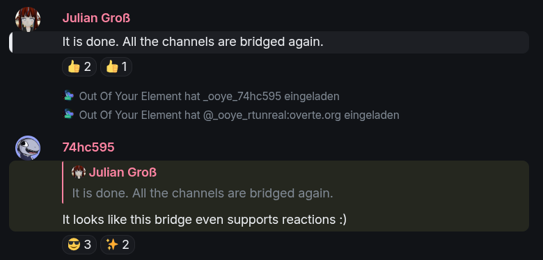
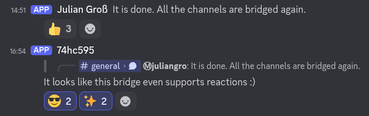
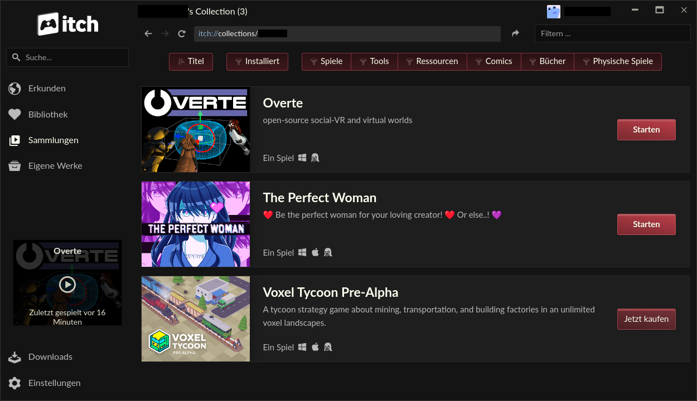
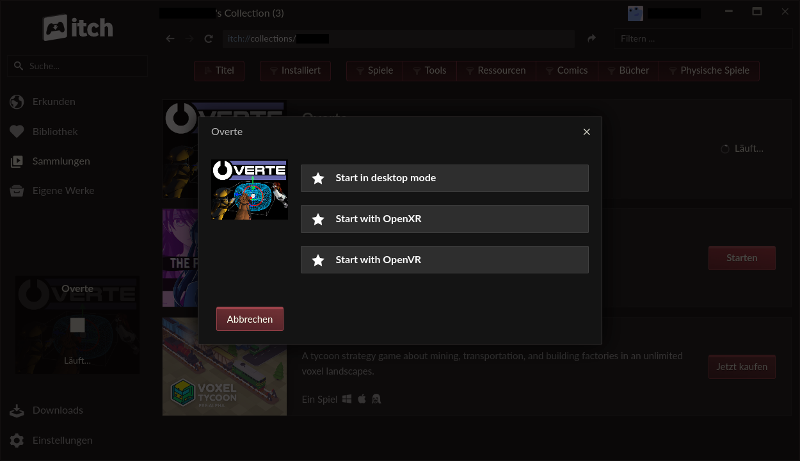

.. post:: 2026-01-23
   :author: Julian Groß

Monthly progress report
-----------------------

Website facelift
^^^^^^^^^^^^^^^^

I finally took the time to give our website a little facelift.
The news section used to be just a long text document. This was replaced with `ABlog <https://github.com/sunpy/ablog>`_ a blogging extension for Sphinx. It makes the news section a little more manageable, without adding much maintenance overhead.
While I was at it, I slightly increased the font size and limited the width of the website.

Matrix bridge
^^^^^^^^^^^^^

I upgraded all of our Matrix rooms to room version 12, which turned out to not be as simple as initially thought.
While t2bot (our Matrix↔Discord bridge at the time) supports room version 12, the bridge only worked in one direction.

After trying to self-host and finding out that the bot itself doesn't actually work with room version 12 (t2bot just uses a `proxy to change requests <https://github.com/t2bot/v12-proxy>`_), I set out to look for greener pastures.
Here come a new bridge which I had never come across on my previous searches for a better bridge: `Out Of Your Element <https://gitdab.com/cadence/out-of-your-element>`_
It isn't supported by `matrix-docker-ansible-deploy <https://github.com/spantaleev/matrix-docker-ansible-deploy>`_ which is used for our Matrix server, but the setup ended up being reasonably easy anyway.
After a whole bunch of user error on my part, I got Out Of Your Element working on the (at that point) still unsupported room version 12.

The end result has been great. Multiple people commented on how much better the new bridge has been working.
As opposed to t2bot, it supports bridging emoji reactions (in both directions), and has been 100% reliable so far.
The reliability being a big thing, because t2bot would frequently fail to bridge messages, or take multiple minutes to do so.

Here are Matrix (Element) and Discord side by side:

|2026-01-23_Element| |2026-01-23_Discord|

The Matrix side of our bridge is seeing a lot more usage now than it ever has.

Release version 2025.12.1
^^^^^^^^^^^^^^^^^^^^^^^^^

Overte version 2025.12.1 was released on the 17th of December.
We had been dreading this one for quite a while, because it is a protocol breaking release, meaning that clients and servers are incompatible with previous versions, which made testing a lot harder than usual.
Sure enough, we ran into a really weird regression, which only happened in one area of one specific server.
Anyone joining and spawning in this area, would get stuck in safe-landing and never finish loading the world around them.

The reason turned out to be as simple as devious: In September we lowered the maximum package size of networking packets (MTU) to fix connection issues for users whose internet providers do not provide them with the usual full size of 1500 bytes.
The one server which was having issues had a single entity, which fit into the old package size, but was too large for the new package size.
Entities are created on the client and transferred to the server, meaning that it is impossible to create an entity larger than the maximum packet size… unless the maximum packet size changes.
Because of this, the server didn't have any safeguards for entities not fitting into a packet and just kept retrying over and over again.

Notice how I said the MTU was changed in September? The 2025.12.1 release wasn't the issue. The server just hadn't been updated until the protocol change required the server to be updated.
The issue was actually a rare regression in version 2025.09.1.

Vulkan
^^^^^^

The Vulkan backend was finally merged into master. This change has been in development for such a long time, it technically predates Overte itself.
Huge thanks to NLnet and the NGI program for sponsoring 74hc595's work on it and huge thanks to 74hc595 and all the people involved for working on this huge undertaking.

While there is still a lot to do, before Vulkan will become our default rendering backend, it is already daily-drivable on Linux.
If you want to give it a try, either build Overte from source using the :code:`-DOVERTE_RENDERING_BACKEND=Vulkan` argument,
or download any Vulkan build created by the CI-pipeline, such as `this one <https://nightly.link/overte-org/overte/actions/runs/21102409135/Overte-PR2011-06de05e-x86_64-Vulkan.AppImage>`__.

itch.io release
^^^^^^^^^^^^^^^

Recently we ran into old regressions, which had not been caught in testing, sometimes for multiple releases, multiple times.
This made us think it was time to get some more people on board and open up Overte to a wider audience.
Itch.io, with its artist community and people who are used to games made by small teams or single people, seemed like the perfect place to open up to a wider audience, without immediately going all the way to Steam.

I spent a bunch of time designing `Overte's itch.io page <https://overte-org.itch.io/overte>`_ and even added support for “itch”, itch.io's desktop app, allowing automatic incremental updates.
A feature, which none of our other distribution channels have yet.

|2026-01-23_itch_app_1| |2026-01-23_itch_app_2|

While I am quite happy with how our itch.io page and the itch app support turned out, there is one issue: itch.io staff appears non-existent.
After publishing Overte on the 30th of December, I noticed that it was unlisted. I contacted itch.io's support, and have yet to receive anything more than an automatic “Request received” message.
On itch.io's Discord server many other users tell similar stories.

If I saw an open-source project in such a state, I would think it is abandoned or its developer is burned out. With a commercial company, I don't know what to think.
Surely they would at least inform people of such long wait times.
Whatever the case may be, having Overte on a store just for it to be unlisted isn't very useful. If this continues, we will just have to drop itch.io support again…
