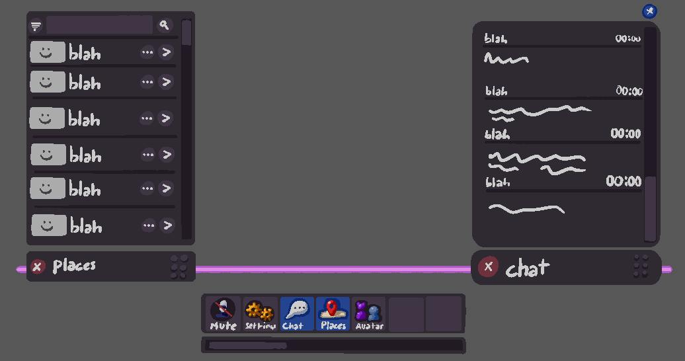
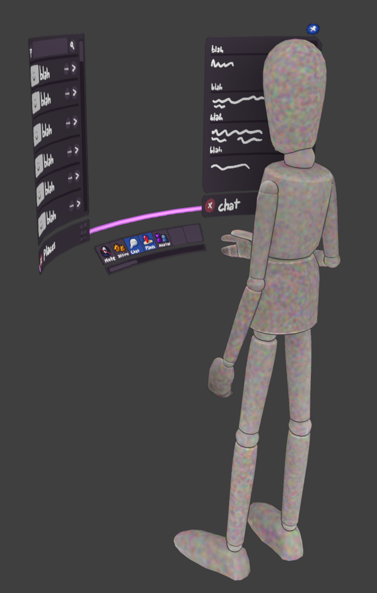
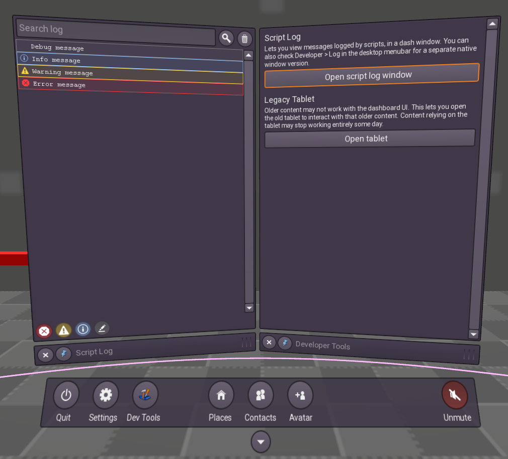

.. post:: 2026-03-09
   :author: Julian Groß

Monthly progress report
-----------------------

.. contents:: Table of Contents
    :local:

Performance regression fixed
^^^^^^^^^^^^^^^^^^^^^^^^^^^^

We fixed a large performance regression introduced in version 2025.09.1.
74hc595 noticed awful performance on their workstation with old dual Xeon E5-2690v2 CPUs getting only 30 FPS with their Nvidia RTX3090 in the tutorial world. Even with such old CPUs, performance should be *much* better than that.
Looking into it myself, I also saw a ~50% decrease in engine (physics) performance on my machine. In my case, 50% higher frame times still meant hitting the 90 FPS frame cap in VR and the 60 FPS frame cap in desktop mode, which is why I never noticed the issue myself.

Our changelog for version 2025.09.1 didn't show anything suspicious, so I set out to use a process called "bisecting" to find out which change introduced the performance regression.
I ran :code:`git bisect` telling it the last known good commit and the earliest known bad commit. Git then checks out commits in the middle for me to manually build, test, and tell Git if it suffers from the issue or not.

After just two hours I found `the culprit <https://github.com/overte-org/overte/commit/209fea6b5821645b36452bf3781ff3450e0ed708>`__: The virtual keyboard used in VR was parented to the avatar.
It turns out that having the virtual keyboard follow you around is extremely computationally expensive, even when it is not in use and even in desktop mode. Why this is the case? I don't know. My assumption is that the keyboard and its individual keys have collisions enabled (probably because of the mallet input), and the physics engine checks if we are colliding with each individual key because of how close we are to them. Having to check for collisions between ~80 moving entities every frame is pretty expensive.

Interesting that something as simple as parenting the keyboard to the avatar in VR could have such large performance impact on *desktop* mode.
The `initial fix <https://github.com/overte-org/overte/pull/2077>`__ is just as simple: Only parent the keyboard to the avatar when it is actually in use.

With this issue out of the way, your laptop or old computer should be running Overte a lot better again. The fix will be in the upcoming 2025.03.1 release.

New Dashboard UI
^^^^^^^^^^^^^^^^

As mentioned in previous progress reports, our upgrade to Qt6 is coupled to a complete UI overhaul.
Recently, Ada started work on the new "dashboard", which is planned to replace the current tablet and HUD.

After a bunch of brainstorming, Ada came up with some mock-ups:

|2026-03-09_dash_mockup_1| |2026-03-09_dash_mockup_2|

And went straight to work, teasing us with screenshots and short video showcases:

|2026-03-09_dash_1|

.. video:: _images/2026-03-09_Monthly_progress_report/dash-proto_2026-02-27_2.webm _images/2026-03-09_Monthly_progress_report/dash-proto_2026-02-27_2.mp4
    :alt: Short video showcasing the dashboard.
    :autoplay:
    :loop:
    :muted:
    :width: 100%
    :align: center

The new UI will be available in the upcoming months, once our update to Qt6 is finished and stable enough for a release.

Flycam
^^^^^^

Another addition by Ada is a new flycam mode, which allows you to more conveniently move your camera around while using the Create app.

.. video:: _images/2026-03-09_Monthly_progress_report/flycam-demo.webm _images/2026-03-09_Monthly_progress_report/flycam-demo.mp4
    :alt: Short video showcasing the flycam.
    :autoplay:
    :loop:
    :muted:
    :width: 100%
    :align: center

It can be toggled by pressing F4 and will be available in the upcoming 2025.03.1 release.

Currently, there are no plans to remove the Altcam (toggled using the Alt key) or the focus mode, which allows you to focus the camera on an entity by selecting it and pressing the F key.

Sunday Overte Warmup event
^^^^^^^^^^^^^^^^^^^^^^^^^^

I also want to take this opportunity to advertise our "Overte Warmup" event, which takes place every Sunday at 12:30 UTC time.

It begins at 12:00 UTC in VRChat and then switches to Overte at 12:30 UTC.
The idea behind it is to spark curiosity in our VRChat friends and bring them over for this occasion.

Keep an eye on the `#events channel <https://matrix.to/#/!ZzFb_DI4Gwv9E7h5bTDLCMxgu9AnkCO3I_acGhB7PN0?via=matrix.org&via=overte.org>`_ on Matrix or Discord for up-to-date information about the event.

.. image:: _images/2026-03-09_Monthly_progress_report/overte-snap-by-X74hc595-on-2026-03-01_14-02-32.jpg
    :alt: Group picture taken at a previous "Overte Warmup".
    :class: inline
