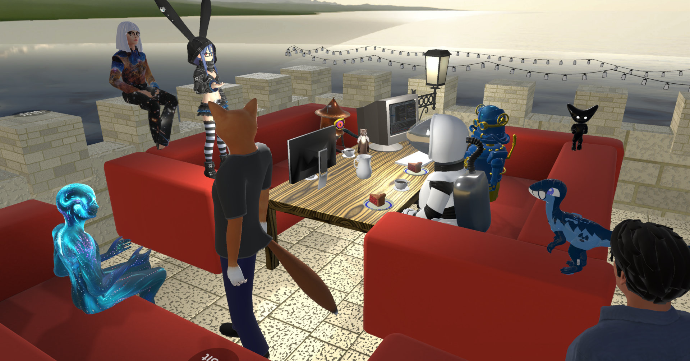

.. include:: shared.rst

#####
About
#####

Overte is an :ref:`open source<reference_to_downloads_source>` virtual worlds and social VR software which enables you to create and share virtual worlds as virtual reality (VR) and desktop experiences. You can create and host your own virtual world,
explore other worlds, meet and connect with other users, attend or host live VR events, and much more.

The Overte software provides the following key features:

* Collaborative world creation and editing
* VR support, including body tracking
* Scalability for up to 500 users in a single world
* Scripting in JavaScript, which allows creation of games, interactables, UI elements, and custom applications
* High quality low latency spatial audio
* Powerful physics through Bullet physics engine
* Fully open-source under the permissive Apache 2.0 license
* No central authority. You can run your own server from home.
* No user account required
* Supported by a democratic non-profit organization

:doc:`Get Overte <downloads>` |DownloadPage| or take a look at our :doc:`Gallery <gallery>` |GalleryPage|.

Join our Matrix Space on |MatrixLink| `overte:overte.org 🔗 <https://matrix.to/#/#overte:overte.org>`_.
Our Matrix Space is also bridged to |DiscordLink| `Discord 🔗 <https://discord.gg/4YuQvc8K2f>`_.

    Development meeting in the Overte office

####
News
####

---------------------------------
2025-09-07 August progress report
---------------------------------

Organizational
^^^^^^^^^^^^^^

Employment
""""""""""

Last post we asked for donations in case unforeseen costs come up with my (Julian Groß) employment. As it turns out, the employment does indeed cost a little bit more (~30€) than I anticipated, costing around 1000€ per month, roughly 710€ of which actually end up on my bank account.  (I say “around” and “roughly” because most months cannot be cleanly divided by 4 weeks.)

I want to personally thank everyone who donated. Most of the people who donated appear to be new people who had never even tried Overte before donating.
I also want to specially thank our regular donators and paying Overte e.V. members, who keep Overte running. You know who you are, and you rock!

Next time, I should have the donation banner count all money paid towards the Overte e.V., instead of just extra funds on top of the regular donations minus transaction fees.
I did it this way for accounting purposes and that was probably just a bad idea.

NLnet grant
"""""""""""

In other news, the NLnet Foundation has accepted another grant (amendment) proposal from us. After having been successfully working with them for over 1 1/2 years now, it feels great to still be among all the amazing open source projects supported by them.

We want to thank NLnet and the European Commission for fostering software freedom with their Next Generation Internet programme.

Project plan
~~~~~~~~~~~~

The funding will be used to pay developers to work on the areas listed below.

Features
********

- Multi-packet avatar updates
- linear interpolation for avatar updates
- Finish multi-packet entity properties

Graphics
********

- Vulkan frame transfer to VR plugin

Maintenance
***********

- Switch to using a package lock file on Conan and updating it semi-automatically using something like Renovate
- Try getting NSIS more foolproof (boolean checks are unreliable as they only check for one possible boolean naming scheme)
- Document networking code

Bug Fixes
*********

- Fix networking congestion control ( https://github.com/overte-org/overte/issues/572#issuecomment-2799907780 )
- Fix retransmissions ignoring congestion control ( https://github.com/overte-org/overte/issues/572#issuecomment-2799907780 )

Entity Transition Shader (Fade)
*******************************

We have a special shader that makes user appear as if they were "beaming in" or "beaming out" when connecting or disconnecting. Apparently, there is unfinished support for doing this to other entities as well, which we would like to fix/finish and polish. This can be used for multiple purposes, but playing similar animations when people edit worlds, for example by deleting entities, is what got us to look into this.

- Add/fix entity transition shader
- Expose avatar and entity transition shader as zone properties
- Expose entity transition shader to Entities.addEntity and Entities.deleteEntity (overriding zone properties)

macOS support
*************

With the Vulkan PR almost merged into master, Apple getting rid of OpenGL isn't a blocker to our macOS support anymore. However, macOS support was broken for multiple years, always was on the back burner, and we moved build systems in-between, so this is a bit of a larger job. We have a good amount of macOS users who are willing to test, and even some people who are still running our last macOS version, eagerly waiting for a new one.

- Get macOS development machine
- Build with MoltenVK
- Get all of our Conan packages to build on macOS
- Fix the server software crashing on macOS
- Set up automatic macOS CI builds

Android support
***************

With the new Conan dependency manager, overhauled build system, and experience with Conan, CMake, and our build system, I now feel comfortable tackling Android support. We used to have experimental Android support, but Google changed so much of their build system API for C++ that that part needs to be completely rewritten.

- Get all of our required Conan packages to build for Android
- Add Android support to our build system
- Set up automatic Android CI builds
- Add initial OpenXR support to our Android client

Depot.dev
"""""""""

Overte got its first corporate sponsor: `Depot.dev 🔗 <https://depot.dev/?utm_source=Overte>`_ is graciously providing us with their Continuous Integration services for free.

With us needing to build Qt from source on Windows, the free GitHub hosted Runners were timing out because our builds would take over 6 hours any time there was a Qt package cache miss. So we needed a solution which didn't involve constant babysitting of the CI pipeline, which would have defeated the point of having a CI pipeline in the first place. Getting faster Runners from GitHub would have costed us upwards of 2000€ extra per year, which frankly would have broken the bank.

This is where Depot.dev comes in. Not only are they *way* cheaper than GitHub hosted Runners and provide a lot more cache space, but they also offer discounts for non-profits and open-source projects.

Interesting enough, even the same spec runners on Depot.dev are actually quite a lot faster at building Overte than the ones on GitHub already.

Progress
^^^^^^^^

Frankly speaking, so much stuff got done this month that I am having a hard time deciding what to mention.

On my side, I have spent most of my time with fixing up our Qt package for Windows and doing more build system improvements. Big thanks to 74hc595 for finding lots of additional issues in my Qt package. 😅
Together, we found out that release builds were actually building with Qt asserts enabled. Asserts are basically deliberate crashes, which exist to make us developers aware of something unexpected happening. They shouldn't be enabled in a release build, as the application often continues to function even when something we didn't expect happens.
It's quite frustrating working on something that takes three hours to build any time there is a change on an operating system you aren't usually developing on, but I am quite happy with the results.

Thanks to NLnet, I also started working on macOS support. For now, I got all the required dependencies to build and am waiting for Vulkan to be merged and our update to libnode 22 to be finished.

74hc595 did a *lot* of work as usual. They fixed multiple audio issues, helped a lot with getting Pull Requests finished, tested and merged, fixed that weird bug with people starting floating while having their camera zoomed into the back of their heads, fixed multiple crashes on Windows, … you get the idea.

Ada also did a lot of miscellaneous bug fixes, but also upstreamed their Context menu, fixed a lot of issues with VR and OpenXR, added OpenXR body tracking support, added multiple new JavaScript APIs, et cetera.
We keep merging Pull Requests and Ada keeps opening new ones.

HifiExperiments added initial VRM file format support, fixed remaining issues with his new multi-layered materials, and helped Ada and 74hc595 with graphics work as usual.

Alezia worked on improving the Snap app, added bookmarks and per-Place user counts to the Places app, and cleaned up the Places app's code.

We also got a new contributor this month: RTUnreal started work on packaging Overte for NixOS. To that end, they already added support for our build system to use only system libraries, uncovered and fixed some bugs, and have been a huge help with the libnode 22 upgrade.
Considering how many people already dabbled with trying to build Overte using Nix and gave up once they realized how much work it is going to be, it is especially great to see RTUnreal get changes merged into Overte.

Release candidate!
^^^^^^^^^^^^^^^^^^

On the topic of progress: We tagged our first release candidate since switching from VCPKG to Conan. Version 2025.09.1-rc1 and its changelog are available `here 🔗 <https://github.com/overte-org/overte/releases/tag/2025.09.1-rc1>`_ and come with a *huge* list of bug fixes, improvements, additions, and changes.
So far, this release candidate has been rock solid, so it might turn into a full release already next week without any additional changes necessary.

--------------------------------------
2025-06-07 Help us hire a team member!
--------------------------------------

We are in the process of hiring our long-term contributor Julian Groß, allowing him to dedicate more time to Overte and get things done.

The current proposal is a one-year-long contract for 13 hours per week at German minimum wage. While not much, this is enough for Julian to survive and make work on Overte his main profession.

However, while the Overte e.V. can technically afford that, we are cutting it close. That is why we are asking for your support!

We need to keep some financial cushioning in case of unforeseen costs, so we are doing our first fundraiser to reach our goal of 3000€ of additional funds over the next couple of months.

.. button-ref:: donate
    :ref-type: doc
    :shadow:
    :color: primary

        Donate now ♥︎

----------------------------------------------
2025-04-04 We've obtained another NLnet grant!
----------------------------------------------

After the success of our previous grant, which enabled myriad fixes, improvements, and new features, we are pleased to announce that we've obtained a second NLnet grant!

The NLnet Foundation continues to support many amazing Open Source projects, and we're honored to continue partnering with them.

As with the previous grant, we commit to keeping users and developers up to date with the progress made on these items, both during our usual Saturday development meetings and on GitHub, so that everyone can follow along with the progress.

Project plan
^^^^^^^^^^^^

The funding will be used to pay developers to work on the areas listed below, with the possibility of extensions and additional work.

The agreed upon deadline for completion is December 1st, 2025.

Features
""""""""

We would like to allow less technical users to more comfortably make use of all the features
provided by our scripting engine. To that end, we would like to add a visual scripting system.

* Visual scripting (https://github.com/overte-org/overte/issues/982)
* Chat messages in 3D space (https://github.com/overte-org/overte/issues/1147)
* Add copy and paste buttons to VR keyboard (https://github.com/overte-org/overte/issues/130)
* Support OpenXR finger tracking (https://github.com/overte-org/overte/issues/224)
* Cryptography functions in scripting API (https://github.com/overte-org/overte/tree/feature/cryptography)
* Add live translation support to chat

Graphics
""""""""

Our engine uses its own internal graphics API, which is largely undocumented. Documenting this API is a lot of work and important for the future maintainability of the project. Additionally, we would like to spend more time on Vulkan optimization, especially on troubleshooting performance issues on Intel Arc graphics cards.

* Vulkan optimization
* Internal graphics API documentation
* Have local lights affect MToon materials (https://github.com/overte-org/overte/issues/1131)
* Expose normal map attenuation distance as zone property (https://github.com/overte-org/overte/issues/1139)
* Use standard physically-based-rendering for voxels (https://github.com/overte-org/overte/issues/749)
* Allow switching between graphics APIs through command line option
* Add splat mapping functionality (https://github.com/overte-org/overte/issues/1163)
* Add a no-filter texture filtering mode (https://github.com/overte-org/overte/issues/145)

QML Localization
""""""""""""""""

As Overte is used by people from all over the world, we want to add localization support. This task
aims to allow translating all internal UI created using QML. (Most, but not all, of our UI uses QML.)

* Mark strings as translatable
* Generate translation files automatically
* Hook up to Weblate translation system
* Build with translations
* Check if we include the required fonts
* Add German translation (as a reference test case)

Maintenance
"""""""""""

CMake 4.0 is around the corner, dropping support for some legacy compatibility, which seems to
break almost every one of our dependencies. Libnode has similarly received updates, including
breaking changes.

* Update Overte for CMake 4.0 compatibility
* Fix building dependencies on CMake 4.0
* Update libnode to the next LTS version
* Improve build instructions for building with KDevelop and CLion
* Add automatic Docker release builds
* Finish getting Overte into Flathub
* Update to Qt 6 (https://github.com/overte-org/overte/issues/1243)
* Package Qt 6 dependency for Windows
* Package Qt 6 dependency for Linux
* Package webrtc-audio-processing
* Switch to libdatachannel

Bug Fixes
"""""""""

* Fix MToon materials not showing up in Material Inspector (https://github.com/overte-org/overte/issues/1028)
* Text entities: show tofu character on missing character (https://github.com/overte-org/overte/issues/1133)
* Add "blocklist" for known broken graphics drivers
* Fix server Console trying to connect to highfidelity.com (https://github.com/overte-org/overte/issues/578)
* Fix QML warning message spam on Windows (https://github.com/overte-org/overte/issues/593)
* Fix problems with HifiControlsUit.SpinBox (https://github.com/overte-org/overte/issues/921)
* Fix uninstalling Overte not removing cache from AppData\Local (https://github.com/overte-org/overte/issues/952)
* Fix avatar bookmarks silently failing on broken syntax (https://github.com/overte-org/overte/issues/192)

UI Rework
"""""""""

Our current UI is a mix of different themes, design philosophies, and programming languages (https://github.com/orgs/overte-org/projects/8). Specifically our Create app could use some
improvement (https://github.com/overte-org/overte/issues/1145).

* Framework for default QML applications
* Rework Avatar app
* Add grid shader to Create
* Allow switching Create windows between external and embedded windows
* Rework asset browser
* Rework voxel edit mode
* Allow parenting entities using drag and drop in entity list
* Add a tree view to entity list
* Add a free camera mode to Create
* Improve material management in Create
* Add centered scaling to Create
* Rework More app
* Rework settings
* Rework Pal app (People list)
* Rework log viewer
* Rework Snapshot app
* Rework Emote app
* Rework running scripts window
* Rework Places app
* Rework notifications
* Add theming support
* Prefer using system file-picker
* Add dashboard user interface

Integrate results from UX review and security audit
"""""""""""""""""""""""""""""""""""""""""""""""""""

* Perform UX review
* Perform Security audit

Thanks
""""""

* NLnet, for continuing to support Overte.
* Julian Groß, for negotiating this agreement.
* All of the developers who have agreed to take on this work.
* The Overte community, for making this possible.

--------------------------------------
2024-04-16 NLnet grant extended again!
--------------------------------------

We've obtained another extension to the NLnet grant, with the following additional items:

Maintenance
^^^^^^^^^^^

* Fix warnings and allow turning on warnings-as-errors (https://github.com/overte-org/overte/issues/930)
* Clean up Application.cpp so it's not 10,000 lines (https://github.com/overte-org/overte/issues/931)
* fix setting joint data by name (https://github.com/overte-org/overte/issues/613)
* Replace the old wearables system with avatar entities to deduplicate code. (https://github.com/overte-org/overte/issues/932)

Text entities
^^^^^^^^^^^^^

Our text entities need some love. They are clunky, and most importantly they use a custom format that isn't documented anywhere; Meaning that we cannot add new fonts, which is especially bad because the current fonts only support ASCII character.

* clip to edges instead of completely disappearing (https://github.com/overte-org/overte/issues/583)
* Switch to a standard font format (https://github.com/overte-org/overte/issues/126)

Graphics improvements II
^^^^^^^^^^^^^^^^^^^^^^^^

* Add ambient light color (https://github.com/overte-org/overte/issues/6)
* Loading MToon materials directly from glTF (https://github.com/overte-org/overte/issues/933)
* Optional camera clipping (https://github.com/overte-org/overte/issues/618)
* Custom shader fallback (https://github.com/overte-org/overte/issues/640): One fallback for if a shader fails to load/compile and one for if a user has procedural shaders disabled
* Exposing more graphics settings (tone-mapping, bloom, procedural shaders, AO) (https://github.com/overte-org/overte/issues/740, https://github.com/overte-org/overte/issues/741, https://github.com/overte-org/overte/issues/14)
* add tone-mapping and Ambient Occlusion properties to Zone entities (https://github.com/overte-org/overte/issues/934)

Miscellaneous improvements II
^^^^^^^^^^^^^^^^^^^^^^^^^^^^^

* Add VR laser smoothing which will especially help people with shaky hands (https://github.com/overte-org/overte/issues/883)
* Increase loading priority of avatar entities (https://github.com/overte-org/overte/issues/834)
* Add option to not have an avatar show until its entities are loaded (https://github.com/overte-org/overte/issues/834)
* Improve current loading priority system (https://github.com/overte-org/overte/issues/834)
* Add a property to influence load priority of entities (https://github.com/overte-org/overte/issues/834)

--------------------------------
2024-04-02 NLnet grant extended!
--------------------------------

We've obtained an extension to the NLnet grant, with the following additional items:

Linux FHS Support
^^^^^^^^^^^^^^^^^

The Linux Filesystem Hierarchy standard defines the proper file layout for an application. This work would involve adopting it, and adding some nice improvements as well.

This will:

* Make packaging easier and allow inclusion in distributions.
* Make SELinux easier.
* Allow easy instancing out of the box.
* Make Mac packaging easier.

Tasks:

* Domain server/assignment client implementation (https://github.com/overte-org/overte/issues/903)
* Interface implementation (https://github.com/overte-org/overte/issues/904)

LDAP Support
^^^^^^^^^^^^

LDAP is a common authentication mechanism, widely supported in organizations. Active Directory is compatible as well.

This will help Overte integrate much better into corporate and university structures. They could use their own internal system to control authentication. We'd save the need to write that code ourselves, which is of little interest and has been done better by other projects.

Tasks:

* Basic support in domain web UI to allow multiple users to authenticate. (https://github.com/overte-org/overte/issues/905)
* Basic support as an alternative to directory server: user accounts, domain directory. (https://github.com/overte-org/overte/issues/906)
* Full alternative to directory server. Support user relationships, data storage, profile metadata. (https://github.com/overte-org/overte/issues/907)

IPv6 Support
^^^^^^^^^^^^

IPv6 adoption is reaching quite good levels as of late, and is especially important in environments that are hurting for IPv4 addresses such as corporate, universities, cloud and large deployments.
Some providers already are charging extra for IPv4 addresses, so supporting IPv6 helps making hosting domains cheaper.

Tasks:

* Basic support in domain web UI. (https://github.com/overte-org/overte/issues/908)
* Support for fetching assets over IPv6 in interface. (https://github.com/overte-org/overte/issues/909)
* Support for domains running on IPv6. (https://github.com/overte-org/overte/issues/910)

SELinux
^^^^^^^

SELinux is a security system that allows sandboxing applications and daemons.

SELinux would sandbox the domain server and optionally the interface, to ensure that any exploits can't affect the rest of the system. For instance, a domain exploit could still break the domain, but couldn't use the server to attack other computers or expose the user's private data.

Tasks:

* Confine domain-server. (https://github.com/overte-org/overte/issues/911)
* Confine assignment clients. (https://github.com/overte-org/overte/issues/912)
* Attempt supporting multiple instances with isolation. (https://github.com/overte-org/overte/issues/913)
* Isolate multiple Overte servers on the same machine from each other. (https://github.com/overte-org/overte/issues/914)
* Confine interface. (https://github.com/overte-org/overte/issues/915)

Canvas texture
^^^^^^^^^^^^^^

This would implement a new concept of a software defined canvas texture. Scripts can draw on it, and clients receive updates.

This has a huge potential range of useful functionality:

* Software defined textures
* Script-generated nametags, banners, status displays, etc.
* Screen sharing without any external dependencies
* Whiteboard
* Synchronized web entity
* Server-side rendered web entity. This would help with the Quest implementation.

Tasks:

* Basic implementation. Texture object, simple operations like painting pixels and blocks. (https://github.com/overte-org/overte/issues/916)
* Proper canvas API. Support for fonts, graphics primitives like rectangles, circles, curves, etc. (https://github.com/overte-org/overte/issues/917)
* Screen sharing (https://github.com/overte-org/overte/issues/918)
* Synchronized web surface. (https://github.com/overte-org/overte/issues/919)

-----------------------------------------
2024-02-24 We've obtained an NLnet grant!
-----------------------------------------

The NLnet Foundation is an organization that supports many amazing Open Source projects, and we're elated to announce that we've also made the list!

As part of the agreement, we commit to keeping users and developers up to date with the progress made on these items at least every two months. For that, we'll keep track of it during our usual Saturday development meetings, and use tags, projects and other functionality on GitHub to make it easy for anyone interested to follow the progress.

Project plan
^^^^^^^^^^^^

The funding will be used to pay developers that will work on the areas listed below. There exists the possibility of more work being agreed between us and NLnet.

The agreed on deadline for completion is February 17, 2025.

Some of the work has already started and can be seen on GitHub: https://github.com/overte-org/overte

Audio Overhaul
""""""""""""""

* Move audio zones to zone properties (https://github.com/overte-org/overte/issues/69)
* Add audio entities (https://github.com/overte-org/overte/issues/69)

Miscelaneous Improvements
"""""""""""""""""""""""""

* Add a wantsKeyboardFocus property for web entities (https://github.com/overte-org/overte/issues/6)
* Add interpolation on model animations (https://github.com/overte-org/overte/issues/317)

Graphics Improvements
"""""""""""""""""""""

* Fix shadow culling on back-faces (https://github.com/overte-org/overte/issues/547)
* Allow opaque particles (https://github.com/overte-org/overte/issues/776#issuecomment-1868203856)
* Finish overhauling TAA with velocity buffer (https://github.com/overte-org/overte/pull/501)
* Add support for GPU particles

Vulkan
""""""

We're currently using OpenGL for 3D rendering. But unfortunately it's fallen out of favor in the last years, and some platforms like Mac are even deprecating it completely. AMD pays very little attention to it, and driver bugs are a frequent annoyance.

Vulkan will provide a much more modern, performant and supported renderer, and should fix our Mac support woes.

* Wireframe rendering
* Forward renderer (for low end hardware)
* Deferred renderer (fully featured)
* Optimization
* Frame transfer to VR plugin

Build system improvements
"""""""""""""""""""""""""
This will make work on Overte more pleasant and make it easier to build. This is important for making maintenance easier and making life easier for future contributors.

* Switching to Conan
* Updating documentation
* Improving build process

Thanks
""""""

* NLnet, for giving us this great opportunity.
* Julian Groß, for negotiating this agreement.
* Sam Gondelman, Karol Suprynowicz and AnotherFoxGuy for taking on the work.
* The Overte community, for making this possible.

----------------------
2023-04-01 New website
----------------------

Since our old 11ty based website was unmaintained and no one knew how to edit it, we created a brand spanking new website using Sphinx, the same system that we have been using for our main documentation for years now.
This also allows us, among other things, to finally translate the website to different languages using Weblate.

If you would like to help translate this website or other parts of Overte, head over to `weblate.overte.org 🔗 <https://weblate.overte.org/>`_.

.. toctree::
    :maxdepth: 2
    :hidden:

    Home <self>
    Calendar <calendar>
    Downloads <downloads>
    Gallery <gallery>
    Contact <contact>
    Documentation 🔗 <https://docs.overte.org>
    API reference 🔗 <https://apidocs.overte.org>
    Donate <donate>
    Overte e.V. <overte_ev>
    Code of Conduct <code_of_conduct>
    Imprint <imprint>
    Privacy policy <privacy_policy>
