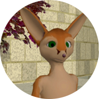
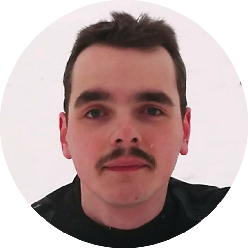
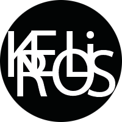
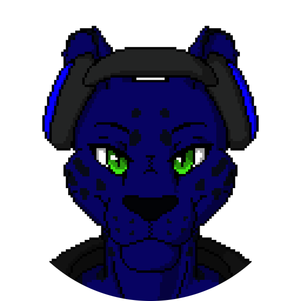

###########
Overte e.V.
###########

The Overte e.V. is the association behind Overte.
It is a non-profit association registered in Germany.

-----------------------
Articles of association
-----------------------

The articles of association, called "Satzung" in German, are the associations bylaws.
They regulate what the association, its members, and the board can and cannot do.

Take a look at them here:

| `Overte e.V. Satzung - German original <https://buyanvr-organizational-code-draft.readthedocs.io/de/latest/>`_
| `Overte e.V. Articles of association - English translation <https://buyanvr-organizational-code-draft.readthedocs.io/en/latest/>`_

.. note::
    While the German original takes precedence over the English translation, we try to make sure that the English translation is as accurate as possible.
    If you notice any discrepancies, please get in touch with us.

--------------------------------
Membership and your Contribution
--------------------------------

.. note::
    To use Overte software or help develop the software it is **NOT** required to be an association member.

You are very welcome to join the association as a member or supporting member.
As a member you are allowed to vote in association meetings. This also includes board member elections.

Currently the yearly membership fee is 60 Euro. The fee is pre paid either yearly or monthly.

If you want to join please make yourself familiar with the articles of association linked above.
To join the association please write an application containing your real name, username (optional), postal address, and email address,
to application@overte.org, or our postal address.

-------------
Current Board
-------------

The current board members were elected on the general assembly on the 17th September 2022.

|Dale_Glass| Dale Glass
~~~~~~~~~~~~~~~~~~~~~~~
| Speaks Spanish, English and Russian.
| Chairman and developer.

|Julian_Groß| Julian Groß
~~~~~~~~~~~~~~~~~~~~~~~~~
| Speaks German, English and basic Japanese.
| Treasurer, deputy chairman, and developer.

|Kreolis| Kreolis
~~~~~~~~~~~~~~~~~
| Speaks German and English.
| Secretary and second deputy chairman.

|74hc595| 74hc595
~~~~~~~~~~~~~~~~~
| Speaks Polish and English.
| Developer

.. |74hc595| image:: _images/board/74hc595.png
    :class: inline2
    :width: 96

|Catraxx| Catraxx
~~~~~~~~~~~~~~~~~
| Speaks German and English.
| Former website developer

